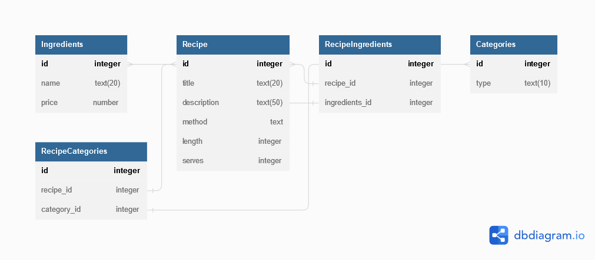

# Recipe Book Application

The aims of this app are to store and manage an application to provide features to:

1. Create and store recipes 
2. Manage a shopping list
3. Create the weekly meal plan

The recipe app uses a database backend that holds the persistent list of entered recipes. This list is then queried from the database and the Recipe class creates the cards in the app for displaying the information. 

For Windows and Linux, the sqflite_common_ffi library is used to apply a wrapper to the SQLite3 for working on the platform that isn't MACOS, Android or iOS. 

## Recipes

The recipe segment of the app shows a list of recipes which are held in a SQLite database. The tables of which are shown below: 

Each recipe contains: 

1. Title
2. Description
3. Method
4. Ingredients
5. Length
6. Serves
7. Categories

## Icons 
- takeout_dining 
- soup_kitchen
- rice_bowl 
- restaurant
- recommend 
- ramen_dining
- local_grocery_store
- local_bar
- local_cafe
- liquor
- kitchen 
- edit_sharp
- delete